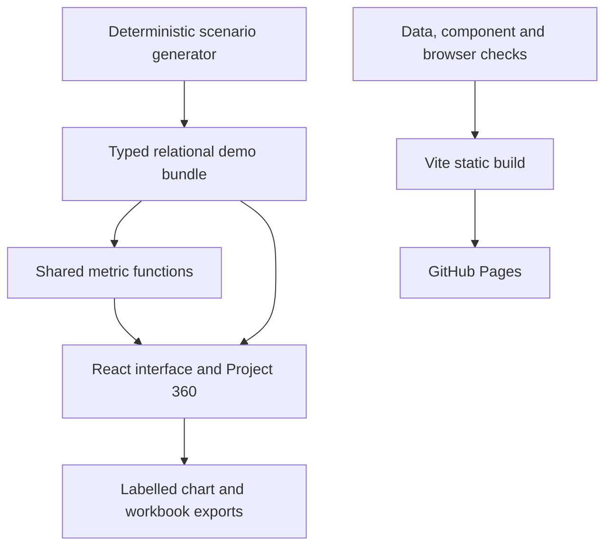

# Atlas Impact Network

## Program Intelligence Hub

An independent portfolio application connecting project delivery, people, resources, funding, and risk response in one usable decision tool.

**Portfolio owner:** [Ivan Morales · Infanatoca17](https://github.com/Infanatoca17)

**Intended live demo after publication:** https://infanatoca17.github.io/program-intelligence-hub/

> This is an independent portfolio implementation built with synthetic data. It does not contain or reproduce confidential employer code, systems, or datasets.

## Why this product exists

Program teams often review delivery, staffing, finance, and risk in separate files. This demo shows how a consistent relational model and a connected interface can support faster, more informed conversations. A reviewer can filter a program, spot a delivery gap, and open the related response plan without changing tools.

The portfolio narrative is: **I design data products, automate reporting workflows, and translate complex organizational information into tools people can use.**

## Explore it in one minute

1. Start on Overview and select **Health** in the Program filter.
2. Select **Review delivery** to inspect projects behind schedule.
3. Open a project from a table or chart to explore Project 360.
4. Review its deliverables, response plan, people, and financials.
5. Export a filtered workbook, or download a chart as PNG or SVG.

## Run locally on Windows

Use **Command Prompt** and Node **22.14+ within major 22**, or Node **24 LTS**. Both are supported by this independent edition. Python, SharePoint, external data accounts, and API secrets are not required.

```bat
cd /d C:\Users\USER\github-portfolio\program-intelligence-hub
npm.cmd ci
npm.cmd run build
npm.cmd run preview
```

Open http://127.0.0.1:4173/program-intelligence-hub/ and keep the terminal running. Stop with **Ctrl+C**.

For editing, run `npm.cmd run dev` and open the address shown by the terminal. The familiar `preview:ui`, `preview:build`, and `preview:verify` commands are aliases for development, build, and tests in this edition.

Read [START_HERE.md](docs/START_HERE.md) for extraction, local Git identity, first push, and GitHub Pages instructions.

## What is included

| View | Working interactions |
|---|---|
| Overview | Calculated KPIs, rotatable geographic globe, clickable project exposure chart, program filters, delivery attention summary |
| Projects | Expected vs actual progress, schedule and site filters, sortable/paginated directory, Project 360 |
| Deliverables | Completion and deadline KPIs, clickable status/program charts, filtered export |
| Staff | Unique fictional people, FTE and weekly-hours totals, office/program charts |
| Financials | Budgets, expenditure, forecasts, burn rate, next-year amounts in the register |
| Funding Pipeline | Opportunity stages, requested and weighted amounts, secured total, donor register |
| Risks / Issues | Status, severity, category and impacted-party filters, response owners, overdue actions |
| Project 360 | Project profile, deliverables, response plan, risks/issues, staffing, financials, funding, copyable URL |
| Search / help | Cross-portfolio project, deliverable, person, location and risk search; demo methodology and provenance |

Charts export as **PNG/SVG**. Tables and the current view export as **XLSX**, including an About sheet with the disclaimer. Empty filter results are displayed as an empty state, never fabricated records.

## Data and methods

The four programs are ordered **Sustainability → Health → Governance → Education**.

The deterministic generator creates:

- 48 projects (44 active, 4 planned), 288 deliverables, and 48 response plans.
- 96 risks and 48 issues.
- 96 unique fictional staff members and 48 financial records.
- 24 funding opportunities and 24 fictional demonstration sites.

Every business-data field has an explicit value. IDs are newly generated `ATL-*` identifiers. Contacts use the reserved `.example` namespace. Site names and business scenarios are fictional; country names and land outlines are public geographic context. All records use a fixed **22 September 2026** snapshot so values are reproducible.

The source workbook, reporting bundles, people, donor lists, images, screenshots, compiled webpart files, and connectors from the reference project are not distributed. This is a new implementation of the selected product workflows, **not a SharePoint package or a claim of full visual/behavioral parity**. The demonstration exposure metric is explicitly documented; it is not claimed to be an employer's approved methodology.

See [METHODOLOGY.md](docs/METHODOLOGY.md), [DATA_DICTIONARY.md](docs/DATA_DICTIONARY.md), and [RELEASE_NOTES.md](docs/RELEASE_NOTES.md).

Regenerate the dataset and verify it:

```bat
npm.cmd run data:generate
npm.cmd run build
```

## Architecture



The application loads its data, geography, styling, and logo from its own compiled assets. There are no runtime data services, remote fonts, analytics, external images, authentication flows, or API keys. The GitHub profile link is a normal outbound link opened only by the visitor.

## Validation

`npm run build` runs data tests, DOM component tests, TypeScript checking, compilation, and a production-output audit.

Browser checks are included separately:

```bat
npx.cmd playwright install chromium
npm.cmd run test:ui
```

They test the production app at its actual GitHub Pages subpath. See [VALIDATION.md](docs/VALIDATION.md) for precisely what was executed for this package and the outstanding visual check.

## Publishing

The repository name must be **program-intelligence-hub** unless you also change `base` in `vite.config.ts`.

The included workflow validates pushes and pull requests, then deploys successful `main` builds to GitHub Pages. Set **Settings → Pages → Source → GitHub Actions**. Publication happens in your personal repository after you push; the delivered ZIP itself has not been published.

## Dependencies and licensing

Exact dependency versions are recorded in `package-lock.json`. Public geographic data and third-party software notices are in [THIRD_PARTY_NOTICES.md](THIRD_PARTY_NOTICES.md). No open-source license has been selected for the newly authored application; choose one before inviting reuse if desired.
