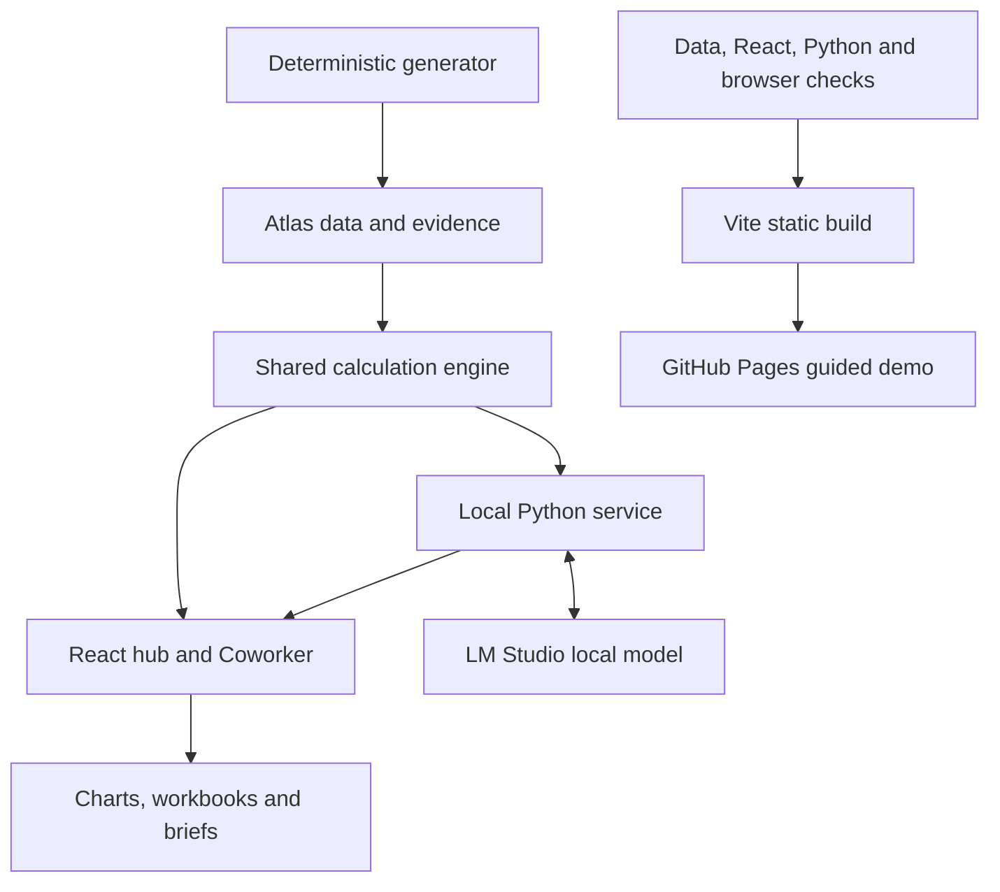

# Atlas Business Intelligence Hub

**Fictional organization:** Atlas Impact Network

**AI Assistant:** Coworker · **Version:** 1.1.1

**Portfolio owner:** [Ivan Morales · Infanatoca17](https://github.com/Infanatoca17)

**Live demo:** [infanatoca17.github.io/business-intelligence-hub](https://infanatoca17.github.io/business-intelligence-hub/)

> This is a demo with dummy data. It does not contain or reproduce copyrighted, confidential or protected code, systems, or datasets.

## Why does this product exist?

At organizations, decision-makers often review data from multiple sources with different reporting methods. To assist them, I designed an integrated data hub that translates complex information into simple and actionable tools that anyone can use. This demo is built using automated workflows, relational models and an intuitive interface to support informed conversations.

Coworker is an AI Assistant: It connects portfolio and project reporting data, evidence review and financial scenarios. The  demo uses verified calculations and guided templates. However, it is enabled to run Python using locally installed LM Studio models to generate insights from verified facts and evidence.

## Explore the Business Intelligence Hub in one minute

1. Start on Overview and select **Health** in the Program filter.
2. Select **Review delivery** to inspect projects behind schedule.
3. Open a project from a table or chart to explore Project 360.
4. Review its deliverables, response plan, people, and financials.
5. Open **Coworker**, ask **Draft the quarterly brief**, and inspect its evidence.
6. Export a filtered workbook, download a chart as PNG/SVG, or review an Executive Brief.

## What is included in this Hub?

| View | Working interactions |
|---|---|
| Overview | Calculated KPIs, exposure and financial consequences, rotatable geographic globe, clickable exposure chart, global filters, delivery attention summary |
| Projects | Deliverable-derived actual vs expected progress, schedule/site filters, sortable/paginated directory, Project 360 |
| Deliverables | Completion and deadline KPIs, clickable status/program charts, filtered export |
| Staff | Unique fictional people, FTE and weekly-hours totals, office/program charts |
| Financials | Budgets, expenditure, forecasts, burn rate, baseline expected consequences, next-year register amounts |
| Funding Pipeline | Opportunity stages, requested and weighted amounts, secured total, donor register |
| Risks / Issues | Status, severity, category and impacted-party filters, response owners, overdue actions, explicit probabilities and USD consequences |
| Coworker | Guided reporting, optional LM Studio narratives, verified fact cards, inspectable source citations |
| Data Quality | Canonical/defect samples, critical/warning findings, raw evidence, quarantine and observation coverage |
| Risk Scenarios | Funding/capacity/probability controls, baseline reconciliation, likelihood-impact matrix, project consequences, CSV/XLSX |
| Executive Brief | Editable narrative, review gates, review reset after changes, Markdown/XLSX export |
| Methodology | Shared delivery, exposure, financial, probability and review assumptions |
| Project 360 | Project profile, deliverables, response plan, risks/issues, staffing, financials, funding, copyable URL |
| Search / help | Cross-portfolio project, deliverable, person, location and risk search; demo methodology |

Charts export as **PNG**. Tables and current views export as **XLSX**. Coworker also provides **scenario CSV** and **executive Markdown** exports.

## Data and methodology

- 48 projects (44 active, 4 planned), 288 deliverables, and 48 response plans.
- 96 risks and 48 issues, with synthetic probability, USD loss and delay assumptions.
- 96 unique fictional staff members and 48 financial records.
- 24 funding opportunities and 24 fictional demonstration sites.
- 576 monthly observations: 12 per project, October 2025–September 2026.
- 6 synthetic methodology/evidence documents, plus inspectable project and reporting records.

Current progress is the mean completion of each project's deliverables. **On track** uses a **±7 percentage-point** tolerance. The ordinal exposure index and expected financial loss use the same non-closed threats but retain separate units. Likelihood levels 1–5 map to **10%, 25%, 45%, 65%, 85%** probabilities; occurred issues use **100%**.

See [METHODOLOGY.md](docs/METHODOLOGY.md), [DATA_DICTIONARY.md](docs/DATA_DICTIONARY.md), and [RELEASE_NOTES.md](docs/RELEASE_NOTES.md).

## Run, validate and update

To run locally, use Node 22.14+ in major 22 or Node 24, and Python 3.10+.

```powershell
npm.cmd ci
npm.cmd run build
npm.cmd run test:python
npx.cmd playwright install chromium
npm.cmd run test:ui
npm.cmd run preview
```

Preview: [127.0.0.1:4173/business-intelligence-hub](http://127.0.0.1:4173/business-intelligence-hub/). The guided demo does not require Python or a model.

- Existing repository/branch: [UPDATE_EXISTING_REPOSITORY.md](docs/UPDATE_EXISTING_REPOSITORY.md).
- Local AI installation, model choice, exact model ID and real inference check: [LM_STUDIO_SETUP.md](docs/LM_STUDIO_SETUP.md).
- Manual checks and reference figures: [WALKTHROUGH.md](docs/WALKTHROUGH.md).
- Executed tests and practical limitations: [VALIDATION.md](docs/VALIDATION.md).

There is one workflow, `.github/workflows/pages.yml`. It validates the integration branch, pull requests and main. It publishes the frontend to GitHub Pages only after main passes validation. Python and LM Studio run on your local computer, not on GitHub Pages.

## Architecture


```mermaid
flowchart TB
    G["Deterministic generator"] --> D["Atlas data and evidence"]
    D --> M["Shared calculation engine"]
    M --> U["React hub and Coworker"]
    U --> E["Charts, workbooks and briefs"]
    M --> S["Local Python service"]
    S <--> L["LM Studio local model"]
    S --> U
    V["Data, React, Python and browser checks"] --> B["Vite static build"]
    B --> P["GitHub Pages guided demo"]
```

The public application loads its data, geography, styling and logo from compiled assets. It has no operational data connectors, remote fonts, analytics, external images or sign-in. It makes a same-origin capability request to detect the optional local service; on Pages, local AI is unavailable and guided mode remains usable. The GitHub profile link opens only when selected by a visitor.

For local inference, the Python service serves the built frontend and API from localhost. It calls LM Studio's localhost endpoint and keeps optional LM Studio authentication in the server environment. The model can draft text; it cannot replace calculated figures, repair records, send messages or approve reports.

## Dependencies, attribution and licensing

Exact frontend dependency versions are recorded in `package-lock.json`. Model weights are not included. Public geographic data and third-party software notices are in [THIRD_PARTY_NOTICES.md](THIRD_PARTY_NOTICES.md); model licensing belongs to the selected model's source.

This product's concept, direction and implementation belong to Ivan Morales.