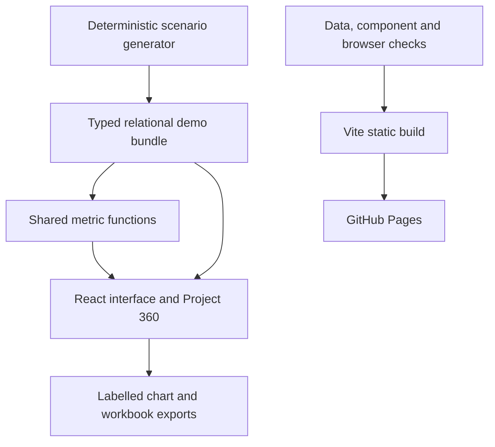

# Atlas Impact Network

## Program Intelligence Hub

**Portfolio owner:** [Ivan Morales · Infanatoca17](https://github.com/Infanatoca17)

**Live demo:** https://infanatoca17.github.io/business-intelligence-hub/

> This is a demo with dummy data. It does not contain or reproduce copyrighted, confidential or protected code, systems, or datasets.

## Why does this product exists?

At organizations, Decision-Makers often review data from multiple sources with different reporting methods. To assist them, I designed an integrated data hub that translates complex information into simple and actionable tools that anyone can use. This demo is bult using automated workflows, relational models and an intuitive interface to support informed conversations. 

## Explore the Business Intelligence Hub in one minute

1. Start on Overview and select **Health** in the Program filter.
2. Select **Review delivery** to inspect projects behind schedule.
3. Open a project from a table or chart to explore Project 360.
4. Review its deliverables, response plan, people, and financials.
5. Export a filtered workbook, or download a chart as PNG or SVG.

## What is included in this Hub?

| View | Working interactions |
|---|---|
| Overview | Calculated KPIs, rotatable geographic globe, clickable project exposure chart, program filters, delivery attention summary |
| Projects | Expected vs actual progress, schedule and site filters, sortable/paginated directory, Project 360 |
| Deliverables | Completion and deadline KPIs, clickable status/program charts, filtered export |
| Staff | Unique fictional people, FTE and weekly-hours totals, office/program charts |
| Financials | Budgets, expenditure, forecasts, burn rate, next-year amounts in the register |
| Funding Pipeline | Opportunity stages, requested and weighted amounts, secured total, donor register |
| Risks / Issues | Status, severity, category and impacted-party filters, response owners, overdue actions |
| Project 360 | Project profile, deliverables, response plan, risks/issues, staffing, financials, funding, copyable URL |
| Search / help | Cross-portfolio project, deliverable, person, location and risk search; demo methodology and provenance |

Charts export as **PNG/SVG**. Tables and the current view export as **XLSX**.

## Data

- 48 projects (44 active, 4 planned), 288 deliverables, and 48 response plans.
- 96 risks and 48 issues.
- 96 unique fictional staff members and 48 financial records.
- 24 funding opportunities and 24 fictional demonstration sites.

For more information, please see [METHODOLOGY.md](docs/METHODOLOGY.md), [DATA_DICTIONARY.md](docs/DATA_DICTIONARY.md), and [RELEASE_NOTES.md](docs/RELEASE_NOTES.md).

## Architecture

```mermaid
flowchart TB
    G["Deterministic scenario generator"] --> D["Typed relational demo bundle"]
    D --> M["Shared metric functions"]
    D --> U["React interface and Project 360"]
    M --> U
    U --> E["Labelled chart and workbook exports"]
    V["Data, component and browser checks"] --> B["Vite static build"]
    B --> P["GitHub Pages"]
```

The application loads its data, geography, styling, and logo from its own compiled assets. There are no runtime data services, remote fonts, analytics, external images, authentication flows, or API keys. The GitHub profile link is a normal outbound link opened only by the visitor.

## Dependencies and licensing

Exact dependency versions are recorded in `package-lock.json`. Public geographic data and third-party software notices are in [THIRD_PARTY_NOTICES.md](THIRD_PARTY_NOTICES.md).
